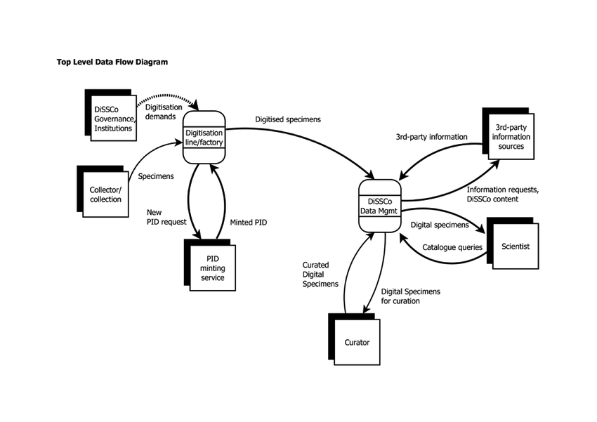

# About

This repository is part of the [DiSSCo](https://dissco.eu) project. One of the services under development is ELViS (**E**uropean **L**oans and **Vi**sit **S**ystem) which will unify access requests to all specimens in collections in Europe (490Mio of 21 [Synthesys+](http://www.synthesys.info/) institutions to start with), integrate a live data dashboard reporting on collection data and access, and it will deliver improved management on loans and for digitization on demand workflows. for an overview of the user stories in groups see: https://github.com/DiSSCo/user-stories/projects/1

Big picture goals: 
* Single sign-on (ORCID integration & IAA pilot)
* Researchers’ profiles to ensure credibility
* Faceted discovery of collections material across participating facilities
* Online applications of Transnational and Virtual Access plus helpdesk
* Online applications for loans and monitoring of loans
* Digitisation on Demand workflows support
* Reporting on specimens demand by loans over time with a live data dashboard
* Testbed for DS Architecture with CORDRA & DOIPv2

# Motivation

The DiSSCo Coordination team is collecting user stories to better understand the needs and requirements of the community and to prepare our development roadmap.

# Top Level Data Flow (for DiSSCo) 

# Structure of user stories 

User stories are short and simple descriptions told from a perspective of a given stakeholder/persona. The typical format is: 
*As a < stakeholder >, I want < some goal/function/feature > so that < some reason/add value >*.

For example: 

*As an ornithologist I want physical and virtual access to the specimens of extinct and endangered birds so I can study the impact of habitat loss and global climate change.*

*As a principal investigator (PI) of a grant I want a dashboard view of various collections to prepare an annual report.*
