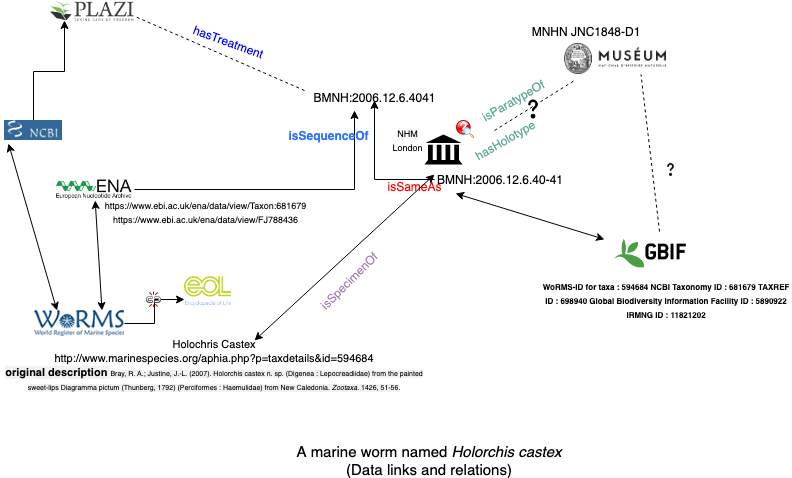

## Link Building 
(DiSSCo Knowledge Graph) 

For a detail explaination and links go [here](https://alexhardisty.wordpress.com/2019/07/25/building-the-dissco-knowledge-graph). 

The fate of a marine worm named Holorchis castex in the digital world. 

Several possible relations (based on museum specimen, taxon name, and genomic data). 


```
Subject	|   Predicate 	|      Object
FJ788436.1	isSequenceOf	           BMNH:2006.12.6.40-41
BMNH:2006.12.6.4041	isSameAs	        BMNH:2006.12.6.40-41
BMNH:2006.12.6.40-41	isParatypeOf	 MNHN JNC1848-D1
BMNH:2006.12.6.40-41	hasHolotype	 MNHN JNC1848-D1
BMNH:2006.12.6.40-41	isSpecimenOf	 Holorchis castex
BMNH:2006.12.6.40-41 	isCircumscribedBy	doi: 10.11646/zootaxa.1426.1.3
BMNH:2006.12.6.40-41	hasTreatment	http://treatment.plazi.org/id/83FE44F3-150E-49F2-901C-69BCD36D9047
Darwin Core	isRepresentationOf	http://treatment.plazi.org/id/83FE44F3-150E-49F2-901C-69BCD36D9047
XML	isRepresentationOf	http://treatment.plazi.org/id/83FE44F3-150E-49F2-901C-69BCD36D9047
RDF	isRepresentationOf	http://treatment.plazi.org/id/83FE44F3-150E-49F2-901C-69BCD36D9047
```

Visual representation: 


