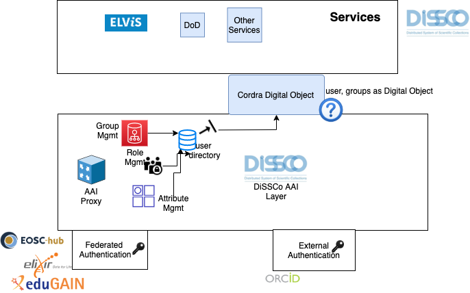

# Introduction 

The goal of this document to provide a short overview of the current AAI technical landscape in the context of various DiSSCo services. 

Various DiSSCo services will require a single sign on and AAI layer. The design of the AAI component will be based on the AARC Blueprint. 





# Background (basic terms) 


* The AAI layer provides authentication (ascertaining that somebody really is who they claim to be / who you are)) and authorisation (refers to rules and policies that determine who is allowed to do what / what you are allowed to do). 
* Federated Identity Management (FIM): “Authenticate locally, authorize globally”. Provide access beyond the user’s own institution, enable collaboration and share across organisation and research infrastructure. 
* Federated identity: A federated identity is the means of linking a person's electronic identity and attributes, stored across multiple distinct identity management systems.
* Single sign-on (SSO) is a property of access control of multiple related, yet independent, software systems. Using SSO a user provides credentials once to gain access to several systems and services. 
* Assurance & Multi Factor Authentication (MFA)  relates to the need for a service provider to be assured that the identity being verified is of a high standard to ensure the necessary trust between the entities. This can be further enhanced through the use of multiple authentication factors to increase assurance and trust that the identity being authenticated is verified. 
* Service Provider (SP) The system component that evaluates the Assertion from an IdP and uses the information from the Assertion for controlling access to protected services. 
* Identity provider (IdP) The system component that issues Assertions on behalf of End Users who use them to access the services of SPs.
* Assertion A digital statement issued by an IdP, derived from the Digital Identity of an End User. Typically an Assertion is digitally signed and optionally encrypted.

# Happy Flow 

A new user comes in to use ELViS, a DiSSCo service. ELViS here is a Service Provider (SP).  ELViS requires authentication but cannot provide authentication as it does not know the new user yet in ELViS. 

ELViS provides a list of trusted Identity Providers (IdPs). For example, the user’s home organisation or a national or international federation (or ORCID). This trust needs to be established before. This means attributes are transferred from the organisation IdP to SP through an AAI proxy.  The user selects the IdP that manages the identity of the user. Next, the SP will redirect the user to the selected IdP and there the user is asked to provide credentials.

If authentication is successful, the IdP will create an assertion stating the successful authentication and hands it over to the user. The user can now present a trusted validated identity to the SP and access the service.

# AARC and DiSSCo

The AARC blueprint provides a five component layers architecture grouped by functional roles:

* User Identity: services that provide electronic identities that can be used by users participating in international research collaborations. For DiSSCo ideally, this will be the institutional user id for example: user1@naturalis.nl. If the user is not affiliated with any organisation then using ORCID for authentication is an option (we haven’t decided on this yet). 
* Community Attribute Services: Components related to managing and providing information (attributes) about users, such as community group memberships and roles, on top of the information that might be provided directly by the identity providers from the User Identity Layer. 
* Access Protocol Translation: defines an administrative, policy and technical boundary between the internal/external services and resources.
* Authorisation: contains elements to control the many ways users can access services and resources.
* End-services: where the external services interact with the other elements of the AAI.

# Digital Object 

We are using Cordra as a Digital Object repository. How should we envision this? Here's a cordra digital object "user" with various properties: 


```
{
  "id": "test/b0ac8fc9596372bc3c97",
  "name": "Elvis User",
  "affiliation": "test/cb2a075c3c072c4c0fe9",
  "orcid": "0000-0001-0000-0000"
}
```

Example schema acl from [Cordra documentation](https://www.cordra.org/documentation/design/authentication-and-access-controls.html):

```
{
    "schemaAcls": {
        "User": {
            "defaultAclRead": [ "public" ],
            "defaultAclWrite": [ "self" ],
            "aclCreate": []
        },
        "Document": {
            "defaultAclRead": [ "public" ],
            "defaultAclWrite": [ "creator" ],
            "aclCreate": [ "public" ]
        }
    },
    "defaultAcls": {
        "defaultAclRead": [ "public" ],
        "defaultAclWrite": [ "creator" ],
        "aclCreate": []
    }
}
```


# Requirements

* User’s account in their home university or research institution

(ideally via an Identity Provider / federated identity management layer) 

* Affiliation 
* Role/group 

* ORCID 

* Other Identity providers (Google?) 

* Role based access control


