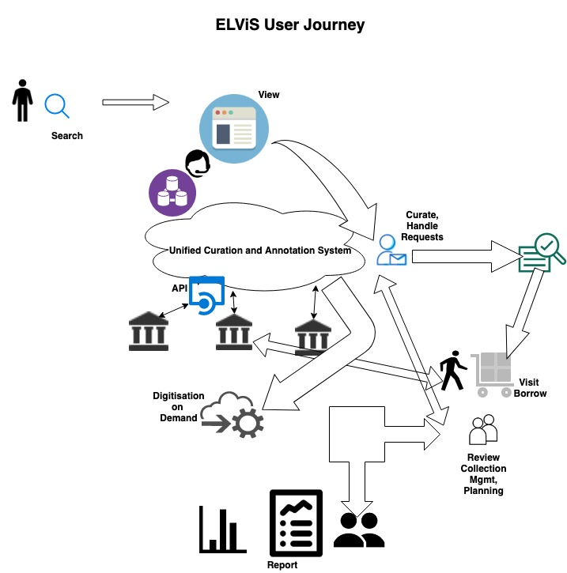

#User Journey / User Flow 

*work in progress*

A simple sketch to show the various stages and different actors/roles. This does not capture everything but will facilitate our discussions and guide the design process. More elaborate and detailed user flow diagrams will be needed later. 

Missing as component in the sketch is the integrated helpdesk
