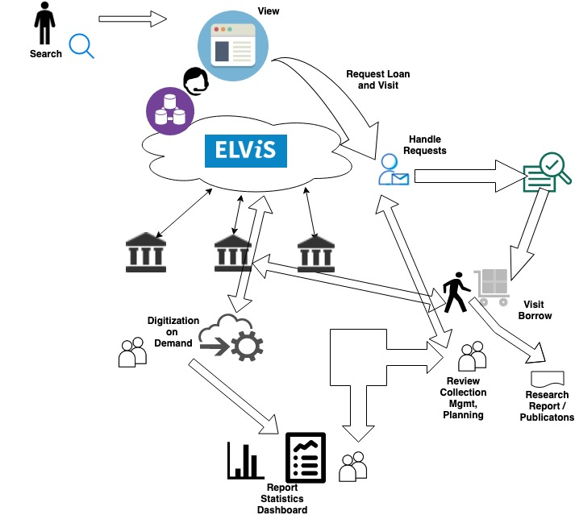

# User Journey / User Flow 

*work in progress*

A simple diagram to show the various stages and different actors/roles. This does not capture everything but will facilitate our discussions and guide the design process. More elaborate and detailed user flow diagrams will be needed later. 

## Mapping / Connecting Stories 

